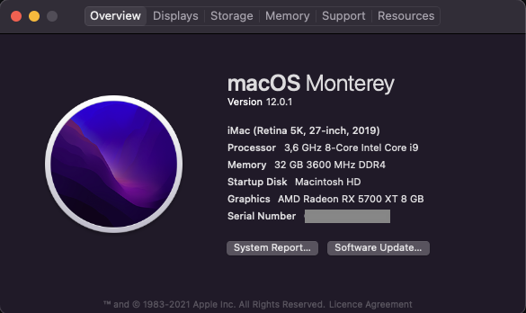

# Asus Z390-A Opencore Hackintosh

This is an OpenCore version of ASUS Z390-A Prime Hackintosh EFI. Used to tripleboot Mac OS, Windows and Linux(Ubuntu). It works on macOS Monterey 12.0.1(21A559). Sleep, Airdrop and Handoff are supported.

## Notes
1. Mac boot chime is added. You may need to modify `config.plist/UEFI/Audio/AudioOut` and `config.plist/DeviceProperties/Add/PathToDevice` based you motherboard layout.
2. For USB ports I picked USBMap.kext without port limit patch. During postinstall probably you will need to make your own.

## Changelog
1. update 0.7.1->0.7.4
2. update 0.7.4->0.7.5
3. update 0.7.5->0.7.6

## Hardware
| Item | Brand | Model | Driver | Comment |
|-----|-----|-----|-----|-----|
| Motherboard | ASUS | Z390-A Prime | | |
| CPU | Intel | i9-9900K | | |
| RAM | XPG | XPG 2x16GB DDR4 3600 | | XMP 3600 |
| iGPU | Intel | UHD 630 | built-in | |
| dGPU | Saphire | RX5700 XT Nitro+ | built-in | |
| SSD1 | Samsung | 970 Evo Plus 2tb nvme | | Main SSD Mac OS |
| SSD2 | Samsung | 980 Pro 1tb nvme | | SSD Windows |
| SSD3 | Samsung | 870 QVO 1tb sata | | SSD Linux |
| Wireless | Broadcom | BCM94360CD | built-in | |
| Ethernet | Intel | I219-V | [IntelMausi](https://github.com/acidanthera/IntelMausi) | |
| Audio | Realtek | ALC S1220A | [AppleALC](https://github.com/acidanthera/AppleALC) | Layout in DeviceProps |
| Monitor1 | Philips | 325E1 | | |
| Monitor2 | MSI | Optix AG32C | | |

## BIOS Setup
| Name | Option | Comment |
| --- | --- | --- |
| Intel SpeedStep | Enabled | |
| Turbo Mode | Enabled | |
| CFG Lock | Disabled | |
| VT-d | Enabled | |
| Above 4G Decoding | Enabled | |
| Re-Size BAR Support | Auto | |
| SR-IOV Support | Enabled | |
| Primary Display | PCIE | |
| iGPU-Multi-Monitor | Enabled | |
| DVMT Pre-Allocated | 1024M | |
| TPM Device Selection | Firmware TPM | |
| Security Device Support | Enable | |
| TPM2.0 UEFI Spec Version | TCG_2 | |
| Serial Port | Off | |
| ErP Ready | Disabled | |
| Legacy USB Support | Enabled | |
| XHCI Hand-off | Enabled | |
| Fast Boot | Disabled | |
| OS Type | Other OS | in case you want windows uefi mode use this [Guide](https://www.tonymacx86.com/threads/guide-opencore-and-uefi-secure-boot-using-windows-subsystem-for-linux.317166/#post-2295190) |
| Launch CSM | Disabled | |

## Known issue
No issues found

## Acknowledgement
Apple for macOS

acidanthera for OpenCore etc.

headkaze for Hackintool
